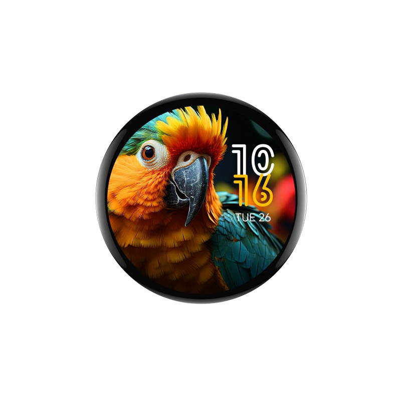

# Waveshare Voice Assistant

A Home Assistant voice assistant running on the **Waveshare ESP32-S3-Touch-AMOLED-1.75**,
built with [ESPHome](https://esphome.io). On-device wake word, a full audio
front-end (AEC + noise suppression + AGC), and a round AMOLED UI with an
animated LED ring and touch controls.

<p align="center">
  
</p>

> This is my personal device configuration. It's tailored to my setup
> (static IP, secrets via `secrets.yaml`), but anyone with the same board can
> build it with their own `secrets.yaml`.

## Hardware

[Waveshare ESP32-S3-Touch-AMOLED-1.75](https://www.waveshare.com/esp32-s3-touch-amoled-1.75.htm)

| Part   | Detail                                          |
| ------ | ----------------------------------------------- |
| MCU    | ESP32-S3 · 16 MB flash · 8 MB PSRAM (octal)     |
| Screen | 1.75" round AMOLED (CO5300), CST9217 touch      |
| Audio  | ES8311 DAC + ES7210 ADC, dual mic with AEC      |

## Features

- Wake-word voice pipeline with idle / listening / thinking / replying states
- esp-sr audio front-end: AEC → noise suppression → AGC (see [`components/README.md`](components/README.md))
- LED ring feedback synced to the assistant state
- Touch controls: tap to wake, hold to mute, swipe for volume

## Build & flash

Requires [ESPHome](https://esphome.io/guides/installing_esphome) 2026.5.x.

1. Create a `secrets.yaml` in the repo root:

   ```yaml
   wifi_ssid: "your-wifi"
   wifi_password: "your-password"
   wifi_static_ip: "192.168.1.50"
   wifi_gateway: "192.168.1.1"
   wifi_subnet: "255.255.255.0"
   api_key: "your-home-assistant-api-encryption-key"
   ota_password: "your-ota-password"
   ```

2. Compile and flash (USB for the first install, OTA afterwards):

   ```bash
   esphome run waveshare.yaml
   ```

The configuration is split into packages under [`core/`](core/) — Wi-Fi, audio,
voice assistant, LED ring, display, touchscreen and UI.
